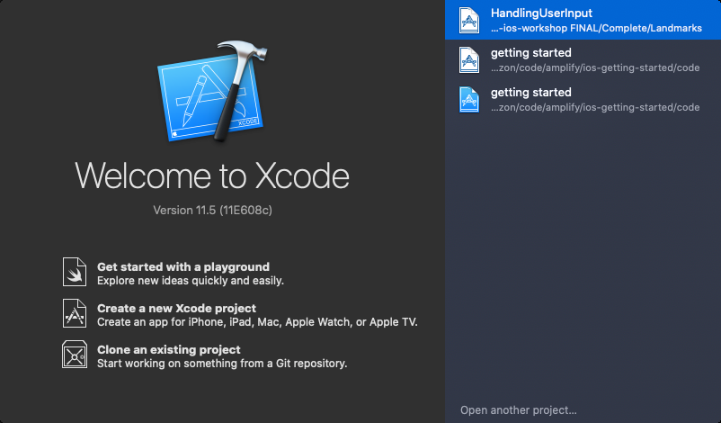
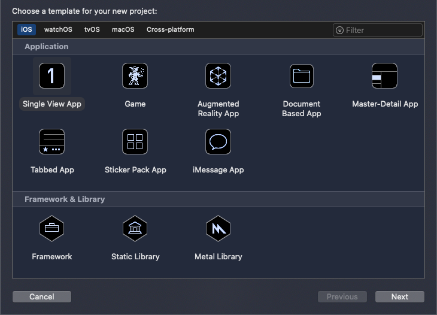
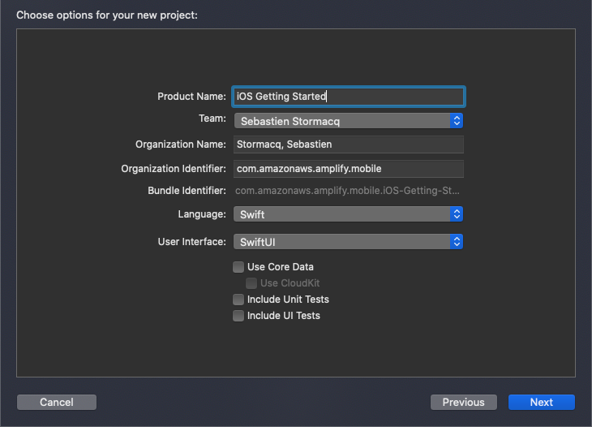
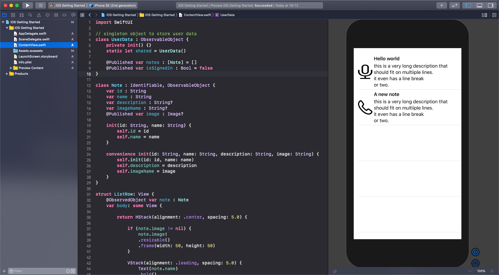
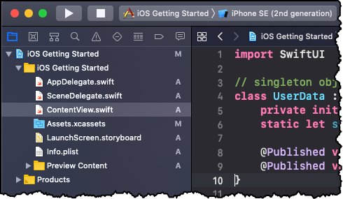
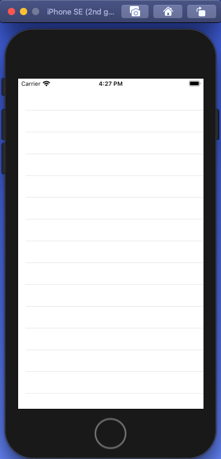

# Introduction

AWS Amplify provides a Git-based workflow for creating, managing, integrating, and deploying serverless backends for web and mobile applications. The Amplify CLI provides a simple text-based user interface to provision and manage backend services, such as user authentication or a REST or GraphQL API for your applications. The Amplify Libraries allow to easily integrate these backend services with just a few lines of code in your applications.

In this module, we’ll begin by creating a new iOS application to take travel notes. A note is made of a title, a description and a picture. We will enhance this application in the following modules.

## What you Will Learn

- Create an iOS application
- Update the main view
- Build and test your application

## Key Concepts

- SwiftUI - [SwiftUI](https://developer.apple.com/xcode/swiftui/) is a simple way to build user interfaces across all Apple platforms with the power of [Swift](https://swift.org/) programming language

# Implementation

## Create an iOS Project

Start Xcode and select **Create a new Xcode project** from the splash screen:



Under **iOS**, **Applications**, select **Single View App** and click **Next**



Type a name for your project, for example **iOS Getting Started**.  Make sure Language is **Swift** and User Interface is **Swift UI**, then click **Next**



Finally, select a directory and click **Create** to create the project.

## Update the Main View

From the file list on the left of Xcode, open `ContentView.swift` and replace the code with this content:

```swift
import SwiftUI

// singleton object to store user data
class UserData : ObservableObject {
    private init() {}
    static let shared = UserData()

    @Published var notes : [Note] = []
    @Published var isSignedIn : Bool = false
}

// the data class to represents Notes
class Note : Identifiable, ObservableObject {
    var id : String
    var name : String
    var description : String?
    var imageName : String?
    @Published var image : Image?

    init(id: String, name: String, description: String? = nil, image: String? = nil ) {
        self.id = id
        self.name = name
        self.description = description
        self.imageName = image
    }
}

// a view to represent a single list item
struct ListRow: View {
    @ObservedObject var note : Note
    var body: some View {

        return HStack(alignment: .center, spacing: 5.0) {

            // if there is an image, display it on the left
            if (note.image != nil) {
                note.image!
                .resizable()
                .frame(width: 50, height: 50)
            }

            // the right part is a vertical stack with the title and description
            VStack(alignment: .leading, spacing: 5.0) {
                Text(note.name)
                .bold()

                if ((note.description) != nil) {
                    Text(note.description!)
                }
            }
        }
    }
}

// this is the main view of our app, 
// it is made of a Table with one line per Note
struct ContentView: View {
    @ObservedObject private var userData: UserData = .shared

    var body: some View {
        List {
            ForEach(userData.notes) { note in
                ListRow(note: note)
            }
        }
    }
}

// this is use to preview the UI in Xcode
struct ContentView_Previews: PreviewProvider {
    static var previews: some View {

        let _ = prepareTestData()

        return ContentView()
    }
}

// this is a test data set to preview the UI in Xcode
func prepareTestData() -> UserData {
    let userData = UserData.shared
    userData.isSignedIn = true
    let desc = "this is a very long description that should fit on multiiple lines.\nit even has a line break\nor two."

    let n1 = Note(id: "01", name: "Hello world", description: desc, image: "mic")
    let n2 = Note(id: "02", name: "A new note", description: desc, image: "phone")

    n1.image = Image(systemName: n1.imageName!)
    n2.image = Image(systemName: n2.imageName!)

    userData.notes = [ n1, n2 ]

    return userData
}

```

### What did we just add?

- I created a `Note` class to store the data of Notes. I used two distinct properties for `ImageName` and `Image`. I will take care of `Image` later on in section [06 Add Storage](o6_add_storage.md)
- I created a `UserData` class to hold specific user's data, at this stage, just a list of `Note` objects.
- the main view `ContentView` contains a `List` of `ListRow`s
- Each line is rendered by a `ListRow` : a horizontal stack with an image and text.  Text is a vertical stack with the note name, in bold, and the note description.
- Finally I adjusted `ContentView_Previews` and added `prepareTestData()` to allow a preview rendering in the canvas.

## Build and Test

Check the Canvas to verify the layout is as desired.  If you do not see the canvas, you can enable it using the **Editor** menu, then click **Canvas**.



Note that the data for the preview are generated in the code (starting at line 67), the data does not appear at runtime. If everything looks OK, Build and launch the app in the simulator. Click **Product** menu and select **Run** or type **&#8984;R**. Alternatively, you can click the **Play** ▶️  button in the toolbar.



After a while, the app starts in the iOS Simulator, with an initial empty screen.



The preview data does not render at runtime, they are only intended for previews inside Xcode.

You are ready to start building with Amplify! 🎉

[Next](/03_initialize_amplify.md) : Initialize Amplify