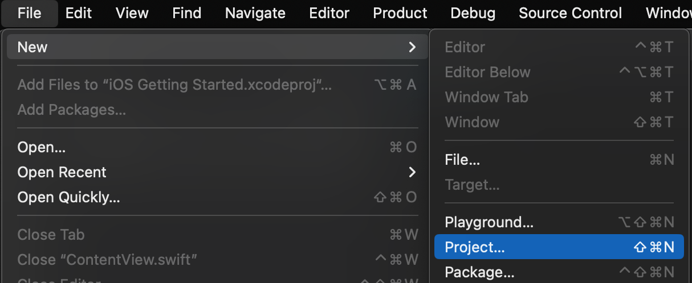
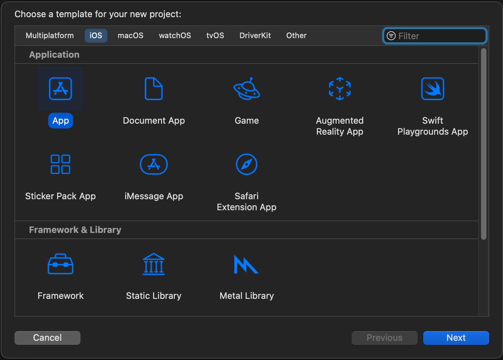
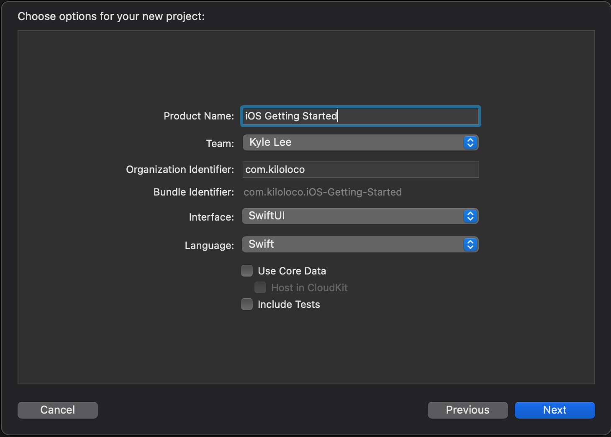
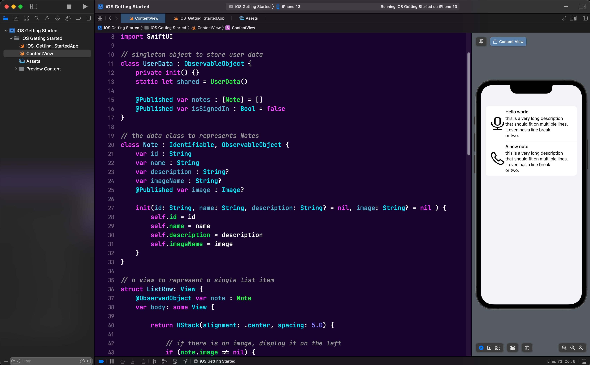
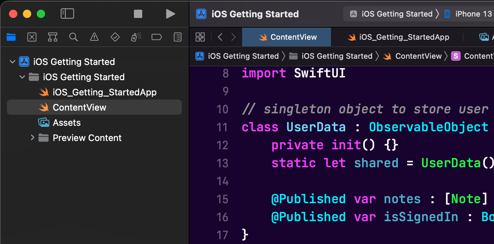
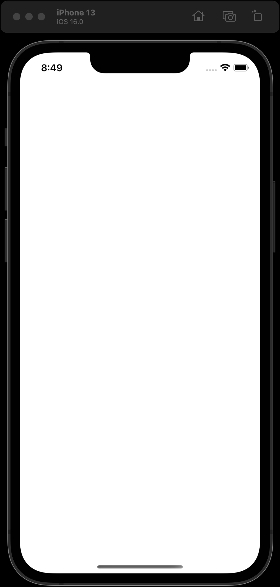

# Introduction

AWS Amplify provides a Git-based workflow for creating, managing, integrating, and deploying serverless backends for web and mobile applications. The Amplify CLI provides a simple text-based user interface to provision and manage backend services, such as user authentication or a REST or GraphQL API for your applications. The Amplify Libraries allow to easily integrate these backend services with just a few lines of code in your applications.

In this module, we’ll begin by creating a new iOS application to take travel notes. A note is made of a title, a description and a picture. We will enhance this application in the following modules.

## What you Will Learn

- Create an iOS application
- Update the main view
- Build and test your application

## Key Concepts

- SwiftUI - [SwiftUI](https://developer.apple.com/xcode/swiftui/) is a simple way to build user interfaces across all Apple platforms with the power of the [Swift](https://swift.org/) programming language

# Implementation

## Create an iOS Project

Start Xcode and create a new project by going to **File > New > Project...** or by hitting **Cmd + Shift + N**



Under **iOS**, **Applications**, select **Single View App** and click **Next**



Type a name for your project, for example **iOS Getting Started**.  Make sure Language is **Swift** and User Interface is **Swift UI**, then click **Next**



Finally, select a directory and click **Create** to create the project.

## Update the Main View

From the file list on the left of Xcode, open `ContentView.swift` and replace the code with this content:

```swift
import SwiftUI

enum AppState {
    case noData
    case loading
    case dataAvailable([Note])
    case error(Error)
}

// ViewModel to manage app state
@MainActor
class ViewModel : ObservableObject {
    
    @Published var state : AppState = .noData
    
    // just a local cache
    var notes : [Note] = []
}

// the data class to represents Notes
class Note : Identifiable, ObservableObject {
    var id          : String
    var name        : String
    var description : String?
    var imageName   : String?
    var createdAt   : Date?
    @MainActor @Published var imageURL : URL?
    
    init(id: String,
         name: String,
         description: String? = nil,
         image: String? = nil,
         createdAt: Date? = nil) {
        self.id          = id
        self.name        = name
        self.description = description
        self.imageName   = image
        self.createdAt   = createdAt
    }
    
    // provide a display ready representation of the date
    var date: String {
        get {
            if let date = self.createdAt {
                let formatter = DateFormatter()
                formatter.dateStyle = .short
                return formatter.string(from: date)
            } else {
                return ""
            }
        }
    }
}

// a view to represent a single list item
struct ListRow: View {
    @ObservedObject var note : Note
    var body: some View {
        
        VStack(alignment: .leading) {
            
            Text(note.date)
                .bold()
            
            AsyncImage(url: note.imageURL) { image in
                image
                    .resizable()
                    .aspectRatio(contentMode: .fill)
                    .padding(.bottom)
            } placeholder: {
                ProgressView()
                    .frame(maxWidth: .infinity)
            }

            Group {
                Text(note.name)
                    .bold()
                
                if let description = note.description {
                    Text(description)
                        .foregroundColor(.gray)
                }
            }
        }
        .padding([.top, .bottom], 20)
    }
}

// this is the main view of our app
struct ContentView: View {
    @EnvironmentObject public var model: ViewModel
    
    var body: some View {
        ZStack {
            switch(model.state) {
                
            case .noData, .loading:
                ProgressView()
                
            case .dataAvailable(let notes):
                navigationView(notes: notes)
                
            case .error(let error):
                Text("There was an error: \(error.localizedDescription)")
            }
        }
    }
    
    @ViewBuilder
    func navigationView(notes: [Note]) -> some View {
        NavigationView {
            List {
                ForEach(notes) { note in
                    ListRow(note: note)
                }
            }
            .navigationTitle(Text("My Memories"))
        }
    }
}

#Preview("Empty State") {
    let model = ViewModel()
    return ContentView().environmentObject(model)
}

#Preview("With Data") {
    let model = ViewModel()
    let desc = "this is a very long description that should fit on multiple lines.\nit even has a line break\nor two."
    
    let n1 = Note(id: "01", name: "Hello world", description: desc, createdAt: Date())
    let n2 = Note(id: "02", name: "A new note", description: desc, createdAt: Date())
    
    model.notes = [n1, n2]
    model.state = .dataAvailable(model.notes)
    
    return ContentView().environmentObject(model)
}
```

### What did we just add?

- I created a `Note` class to store the data of Notes. I used `imageURL` for async image loading that we'll implement later in [06 Add Storage](06_add_storage.md)
- I created a `ViewModel` class following the MVVM pattern to manage app state using an `AppState` enum
- The main view `ContentView` uses a `ZStack` to switch between different states (loading, data, error)
- Each note is rendered by a `ListRow` using a vertical stack with date, async image, title and description
- I used modern SwiftUI `#Preview` macros instead of the deprecated `PreviewProvider` for Xcode canvas previews

## Build and Test

Check the Canvas to verify the layout is as desired.  If you do not see the canvas, you can enable it using the **Editor** menu, then click **Canvas**. You may also need to click the **Resume** button in the Canvas to generate the preview of the layout.



Note that the data for the preview are generated in the code (starting at line 67), the data does not appear at runtime. If everything looks OK, Build and launch the app in the simulator. Click **Product** menu and select **Run** or type **&#8984;R**. Alternatively, you can click the **Play** ▶️  button in the toolbar.



After a while, the app starts in the iOS Simulator, with an initial empty screen.



The preview data does not render at runtime, they are only intended for previews inside Xcode.

Finally, update your `App.swift` file to provide the ViewModel to your ContentView:

```swift
import SwiftUI

@main
struct GettingStartedApp: App {

    var body: some Scene {
        WindowGroup {
            ContentView().environmentObject(ViewModel())
        }
    }
}
```

You have successfully created an iOS app. You are ready to start building with Amplify! 🎉

[Next](/03_initialize_amplify.md) : Initialize Amplify