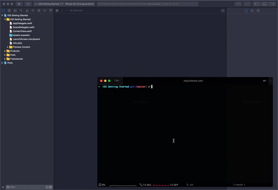

# Introduction 

To start to use AWS Amplify in your applications, you must install the Amplify command line, initialize the amplify project directory, configure your project to use the Amplify libraries, and initialize Amplify at runtime from your code.

## What you Will Learn

- Initialize a new Amplify project
- Add Amplify Libraries in your project 
- Initialize Amplify libraries at runtime

## Key Concepts

- Amplify CLI - The Amplify CLI allows you to create, manage, and remove AWS services directly from your terminal.

# Implementation 

## Install Amplify CLI

AWS Amplify CLI depends on [Node.js](https://nodejs.org/en/), refer to [the prerequisites section in the introduction](/01_introduction.md) to install Node.js.

To install AWS Amplify CLI, open a Terminal, and **type the following command**:

```zsh
## Install Amplify CLI
npm install -g @aws-amplify/cli

## Verify installation and version 
amplify --version
# Scanning for plugins...
# Plugin scan successful
# 4.22.0
```

## Initialize an Amplify Backend

To create the basic structure of our backend, we first need to initialize the amplify project directory and to create our cloud backend.

Open a terminal and change directories to your project. For example, if you created your project in the folder `~/Developer`, you can:

```zsh
cd ~/Developer/iOS\ Getting\ Started
```
To verify you are in the correct directory, it should look like this:
```zsh
➜  iOS Getting Started git:(master) ✗ ls -al
total 32
drwxr-xr-x   9 stormacq  admin   288 Jul  8 15:09 .
drwxr-xr-x  17 stormacq  admin   544 Jul  6 16:20 ..
-rw-r--r--@  1 stormacq  admin  6148 Jul  8 15:06 .DS_Store
drwxr-xr-x   9 stormacq  admin   288 Jul  6 16:12 iOS Getting Started
drwxr-xr-x@  5 stormacq  admin   160 Jul  8 15:09 iOS Getting Started.xcodeproj
```

Initialize the Amplify project structure and configuration file. **Execute the following command**:

```zsh
amplify init 
```

- *? Enter a name for your project (iOSGettingStarted)*: accept the default, press **enter**
- *? Enter a name for the environment (dev)*: accept the default, press **enter**
- *? Choose your default editor*: use the arrow key to select your favorite text editor an press **enter**
- *? Choose the type of app that you're building*: iOS is already selected, press **enter** 
- *? Do you want to use an AWS profile?*, Y, press **enter**
- *? Please choose the profile you want to use*: use the arrow keys to select your profile and press **enter**.

You can create a profile using AWS CLI using `aws configure --profile <name>` if you don't have one yet.

Amplify initilizes your project in the cloud, it might take a few minutes. After a few minutes, you should see a message like:

```
✔ Successfully created initial AWS cloud resources for deployments.
✔ Initialized provider successfully.
Initialized your environment successfully.

Your project has been successfully initialized and connected to the cloud!
```

## Add Amplify Librairies to your Project

1. Before starting this step, please make sure that **you close Xcode**.
   
   Open a terminal and change directories to your project. For example, if you created your project in the folder `~/Developer`, you can:

    ```zsh
    cd ~/Developer/iOS\ Getting\ Started
    ```    

    To verify you are in the correct directory, it should look like this:
    ```zsh
    ➜  iOS Getting Started git:(master) ✗ ls -al
    total 32
    drwxr-xr-x   9 stormacq  admin   288 Jul  8 15:09 .
    drwxr-xr-x  17 stormacq  admin   544 Jul  6 16:20 ..
    -rw-r--r--@  1 stormacq  admin  6148 Jul  8 15:06 .DS_Store
    drwxr-xr-x   6 stormacq  admin   192 Jul  8 15:26 amplify
    -rw-r--r--   1 stormacq  admin    64 Jul  8 15:26 amplifyconfiguration.json
    -rw-r--r--   1 stormacq  admin   116 Jul  8 15:26 awsconfiguration.json
    drwxr-xr-x   9 stormacq  admin   288 Jul  6 16:12 iOS Getting Started
    drwxr-xr-x@  5 stormacq  admin   160 Jul  8 15:09 iOS Getting Started.xcodeproj
    ```

2. In order to initialize your project with the [CocoaPods package manager](https://cocoapods.org/), **execute the command**:

   ```zsh
   ## is Xcode really closed ?

   ## Initialize the Amplify Project
   pod init
   ```

   After doing this, you should see a newly created file called `Podfile`. This file is used to describe what packages your project depends on.

3. **Update `Podfile`** to include the following pods:

    ```
    # Uncomment the next line to define a global platform for your project
    platform :ios, '13.0'

    target 'iOS Getting Started' do
      # Comment the next line if you don't want to use dynamic frameworks
      use_frameworks!

      # Pods for getting started
      pod 'Amplify', '~> 1.0'             # required amplify dependency
      pod 'Amplify/Tools', '~> 1.0'       # allows to call amplify CLI from within Xcode

    end
    ```

4. To download and install the Amplify librairies into your project, **execute the command**:

    ```zsh
    pod install --repo-update
    ```

5. After doing this, you should now see a file called `iOS Getting Started.xcworkspace`. You are required to use this file from now on instead of the `iOS Getting Started.xcodeproj` file.

    To verify you are in the correct directory, it should look like this:
    ```zsh
    ➜  iOS Getting Started git:(master) ✗ ls -al
    total 32
    drwxr-xr-x   9 stormacq  admin   288 Jul  8 15:09 .
    drwxr-xr-x  17 stormacq  admin   544 Jul  6 16:20 ..
    -rw-r--r--@  1 stormacq  admin  6148 Jul  8 15:06 .DS_Store
    drwxr-xr-x   6 stormacq  admin   192 Jul  8 15:26 amplify
    -rw-r--r--   1 stormacq  admin    64 Jul  8 15:26 amplifyconfiguration.json
    -rw-r--r--   1 stormacq  admin   116 Jul  8 15:26 awsconfiguration.json
    -rw-r--r--   1 stormacq  admin   394 Jul  8 15:09 Podfile
    -rw-r--r--   1 stormacq  admin   359 Jul  8 15:09 Podfile.lock
    drwxr-xr-x   8 stormacq  admin   256 Jul  8 15:09 Pods
    drwxr-xr-x   9 stormacq  admin   288 Jul  6 16:12 iOS Getting Started
    drwxr-xr-x@  5 stormacq  admin   160 Jul  8 15:09 iOS Getting Started.xcodeproj
    drwxr-xr-x   3 stormacq  admin    96 Jul  8 15:09 iOS Getting Started.xcworkspace
    ```

    To open your workspace, **execute the command**:

    ```zsh
    xed .
    ```

## Initialize Amplify at Runtime

At runtime, the Amplify libraries required the amplify configuration files generated by the CLI.

1. Add the Amplify Configuration Files to our Project

    Using the Finder, locate `awsconfiguration.json` and `amplifyconfiguration.json` at the root of your project directory and drag'n drop them into your Xcode project:

    

2. Load the Amplify class at Runtime 

    Let's create a `Backend` class to group the code to interract with our backend. I chose to use a singleton to make it easily available thorough the application and to ensure the AMplify libraries are initialized only once.

    The class initializer initializes the Amplify librairies.

    Create a new swift text file `Backend.swift`, add it to your Xcode project (**CTRL-N**) and add this code:

    ```swift

    import UIKit
    import Amplify

    class Backend {
        static let shared = Backend()
        static func initialize() -> Backend {
            return .shared
        }
        private init() {
          // initialize amplify
          do {
            try Amplify.configure()
            print("Initialized Amplify");
          } catch {
            print("Could not initialize Amplify: \(error)")
          }
        }
    }
    ```

    We initialize our singleton `Backend` object when application finishes launching.

    Open the `AppDelegate.swift` file and add `Backend.initialize()` in the `application(:didFinishLaunchingWithOptions:)` method, just like this:
    ```swift
    func application(_ application: UIApplication, didFinishLaunchingWithOptions launchOptions: [UIApplication.LaunchOptionsKey: Any]?) -> Bool {

        // initialize Amplify
        let _ = Backend.initialize()
        
        return true
    }
    ```

## Verify your Setup

To verify everything works as expected, build the project. Click **Product** menu and select **Build** or type **&#8984;B**. There should be no error.