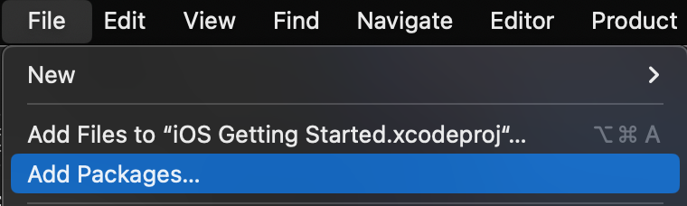
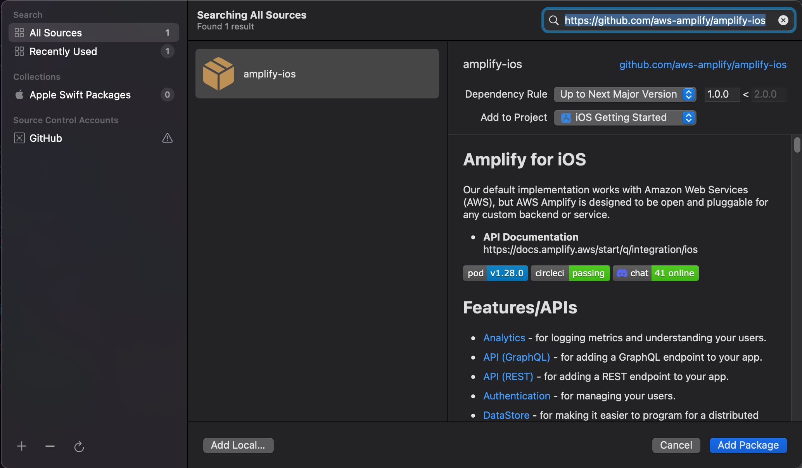
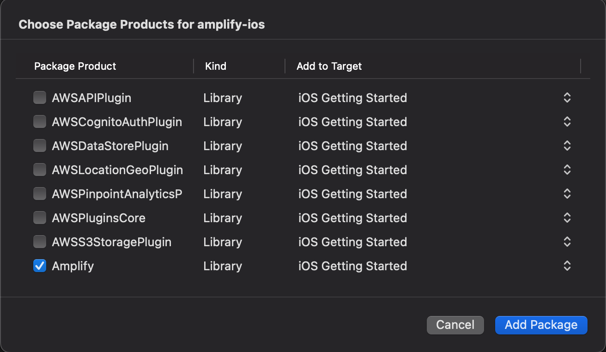

# Introduction

Now that we have created an iOS application, we want to continue development and add new features.

To start to use AWS Amplify Gen2 in your application, you must install Node.js and npm, initialize the Amplify Gen2 project with TypeScript backend definitions, configure your project to use the Amplify libraries, and initialize Amplify Libraries at runtime.

## What you Will Learn

- Initialize a new Amplify Gen2 project
- Add Amplify Libraries in your project
- Initialize Amplify libraries at runtime

## Key Concepts

- Amplify Gen2 - Amplify Gen2 allows you to define your backend using TypeScript, providing type safety and better integration with modern development workflows.

- Amplify libraries – The Amplify libraries allow you to interact with AWS services from a web or mobile application.

# Implementation

## Install Node.js and npm

Amplify Gen2 requires Node.js and npm. If you haven't installed them yet, **type the following command**:

```zsh
# install Node.js & npm (if not already installed)
brew install node

# Verify installation and version
node --version
# v24.10.0

npm --version
# 11.6.0
```

## Initialize an Amplify Gen2 Backend

To create the basic structure of our backend, we need to initialize the Amplify Gen2 project and create our TypeScript backend definition.

Open a Terminal and change directories to your project. For example, if you created your project in the folder `~/Developer`, you can type:

```zsh
cd ~/Developer/iOS\ Getting\ Started
```

Initialize the npm project and install Amplify Gen2 dependencies. **Execute the following commands**:

```zsh
# Initialize npm project
npm init -y

# Install Amplify Gen2 dependencies
npm install aws-amplify
npm install --save-dev @aws-amplify/backend @aws-amplify/backend-cli typescript

# Create the amplify directory structure
mkdir amplify
mkdir amplify/auth
mkdir amplify/data
mkdir amplify/storage
```

Create the backend definition files. First, create `amplify/backend.ts`:

```typescript
import { defineBackend } from '@aws-amplify/backend';
import { auth } from './auth/resource';
import { data } from './data/resource';
import { storage } from './storage/resource';

defineBackend({
  auth,
  data,
  storage
});
```

Create the auth resource at `amplify/auth/resource.ts`:

```typescript
import { defineAuth } from '@aws-amplify/backend';

export const auth = defineAuth({
  loginWith: {
    email: true,
  },
});
```

Create the data resource at `amplify/data/resource.ts`:

```typescript
import { type ClientSchema, a, defineData } from '@aws-amplify/backend';

const schema = a.schema({
  NoteData: a
    .model({
      id: a.id(),
      name: a.string().required(),
      description: a.string(),
      image: a.string(),
    })
    .authorization((allow) => [allow.owner()]),
});

export type Schema = ClientSchema<typeof schema>;

export const data = defineData({
  schema,
  authorizationModes: {
    defaultAuthorizationMode: 'userPool',
  },
});
```

Create the storage resource at `amplify/storage/resource.ts`:

```typescript
import { defineStorage } from '@aws-amplify/backend';

export const storage = defineStorage({
  name: 'image',
  access: (allow) => ({
    'private/{entity_id}/*': [
      allow.entity('identity').to(['read', 'write', 'delete'])
    ],
  })
});
```

Create `amplify/package.json`:

```json
{
  "type": "module"
}
```

Deploy your backend to the cloud:

```zsh
npx ampx sandbox
```

This will deploy your backend and generate the configuration files. After a few minutes, you should see a message indicating the sandbox is ready and `amplify_outputs.json` will be generated.

## Add Amplify Libraries to your Project

1. Switch back to Xcode. Select `File > Add Packages...`



2. Enter the Amplify iOS GitHub repo URL (https://github.com/aws-amplify/amplify-ios) into the search bar and hit **Enter**. Wait for the result to load. You'll see the Amplify iOS repository rules for which version of Amplify you want Swift Package Manager to install. Choose the dependency rule **Up to Next Major Version**, as it will use the latest compatible version of the dependency that can be detected from the main branch, then click **Add Package**.



3. Lastly, choose which of the libraries you want added to your project. For this tutorial, select **Amplify**, **AWSCognitoAuthPlugin**, **AWSAPIPlugin**, and **AWSS3StoragePlugin**, then click **Add Package**.



## Initialize Amplify at Runtime

At runtime, the Amplify libraries require the Amplify configuration files generated by the sandbox.

1. Add the Amplify Configuration Files to our Project

    Using the Finder, locate `amplify_outputs.json` at the root of your project directory (generated by `npx ampx sandbox`). Drag and drop it into your Xcode project:

    

2. Load the Amplify classes at Runtime

    Let's create a `Backend` class to group the code to interact with our backend. I use a [singleton design pattern](https://en.wikipedia.org/wiki/Singleton_pattern) to make it easily available through the application and to ensure the Amplify libraries are initialized only once.

    Create a new Swift file `Backend.swift`, add it to your Xcode project (**CMD+N**) and add this code:

    ```swift
    import SwiftUI
    import Amplify
    import AWSCognitoAuthPlugin
    import AWSAPIPlugin
    import AWSS3StoragePlugin
    import ClientRuntime

    final class Backend: Sendable {
        
        enum AuthStatus {
            case signedIn
            case signedOut
            case sessionExpired
        }
        
        static let shared = Backend()
            
        private init() {
            // initialize amplify
            do {
                try Amplify.add(plugin: AWSCognitoAuthPlugin())
                try Amplify.add(plugin: AWSAPIPlugin(modelRegistration: AmplifyModels()))
                try Amplify.add(plugin: AWSS3StoragePlugin())
                
                try Amplify.configure(with: .amplifyOutputs)
                print("Initialized Amplify")
            } catch {
                print("Could not initialize Amplify: \(error)")
            }
        }
    }
    ```

    We initialize our singleton `Backend` object when the application launches.

    Update your `App.swift` file to initialize the backend:

    ```swift
    import SwiftUI

    @main
    struct GettingStartedApp: App {

        // trigger initialization of the Backend
        let backend = Backend.shared

        var body: some Scene {
            WindowGroup {
                ContentView().environmentObject(ViewModel())
            }
        }
    }
    ```

## Verify your Setup

To verify everything works as expected, build the project. Click **Product** menu and select **Build** or type **&#8984;B**. There should be no error.

[Next](/04_add_authentication.md) : Add user authentication.