# Introduction

The next feature you will be adding is user authentication. In this module, you will learn how to authenticate a user with the Amplify CLI and libraries, leveraging [Amazon Cognito](https://aws.amazon.com/cognito/), a managed user identity provider.

You will also learn how to use the Cognito Hosted User Interface to present an entire user authentication flow, allowing users to sign up, sign in, and reset their password with just few lines of code.

using a "Hosted User Interface" means the application leverages the Cognito web pages for the signin and signup user interface flows. The user of the app is redirected to a web page hosted by Cognito and redirected back to the app after signin.  Of course, Cognito and Amplify does support native UI as well, you can follow [these workshop instructions](https://amplify-ios-workshop.go-aws.com/70_add_custom_gui/30_customized_ui.html) to learn more about custom authentication UI.

## What you Will Learn

- Create and deploy an authentication service
- Configure your iOS app to include Cognito Hosted UI authentication

## Key Concepts

- Amplify libraries – The Amplify libraries allow you to interact with AWS services from a web or mobile application.

- Authentication – In software, authentication is the process of verifying and managing the identity of a user using an authentication service or API.

# Implementation

## Create the Authentication Service

To create the authentication service, open a Terminal and **execute this command** in your project directory:

```zsh
amplify add auth
```

- *? Do you want to use the default authentication and security configuration?* Select **Default configuration with Social Provider** and press **enter**
- *How do you want users to be able to sign in?* Select the default **Username** and press **enter**
- *Do you want to configure advanced settings?* Select the default **No, I am done** and press **enter**
- *What domain name prefix do you want to use?* Select the default and press **enter**
- *Enter your redirect signin URI:* type **`gettingstarted://`** and press **enter**
- *? Do you want to add another redirect signin URI?* Select the default **N** and press **enter**
- *Enter your redirect signout URI:* type **`gettingstarted://`** and press **enter**
- *? Do you want to add another redirect signout URI?* Select the default **N** and press **enter**
- *Select the social providers you want to configure for your user pool:* do not select any provider and press **enter**

You know the configuration is successful when you see the message (the exact name of the resource will vary) :

```text
Successfully added resource iosgettingstartedfc5a4717 locally
```

**DO NOT FORGET to enter the two redirect URIs above (`gettingstarted://`), this is mandatory to have the redirection to Cognito Hosted UI to work**

## Deploy the Authentication Service

Now that the authentication service has been configured locally, you can deploy it to the cloud. In a Terminal, **execute this command** in your project directory:

```zsh
amplify push

# press Enter (Y) when asked to continue
```

After a while, you should see the following message:

```zsh
✔ All resources are updated in the cloud

Hosted UI Endpoint: https://iosgettingstarted-dev.auth.eu-central-1.amazoncognito.com/
Test Your Hosted UI Endpoint: https://iosgettingstarted-dev.auth.eu-central-1.amazoncognito.com/login?response_type=code&client_id=1234567890&redirect_uri=gettingstarted://
```

## Add Amplify Authentication Library to the Project

Before going to the code, you add the Amplify Authentication Library to the dependencies of your project.  Navigate to the **General** tab of your Target application (Your Project > Targets > General) and click the plus (+) in the **Frameworks, Libraries, and Embedded Content** section:

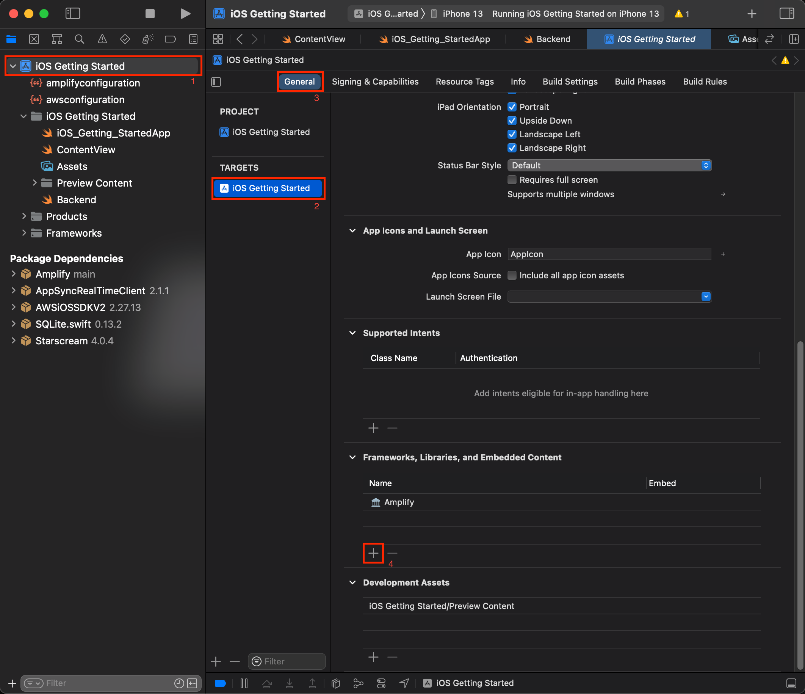

Select **AWSCognitoAuthPlugin** and click **Add**: 

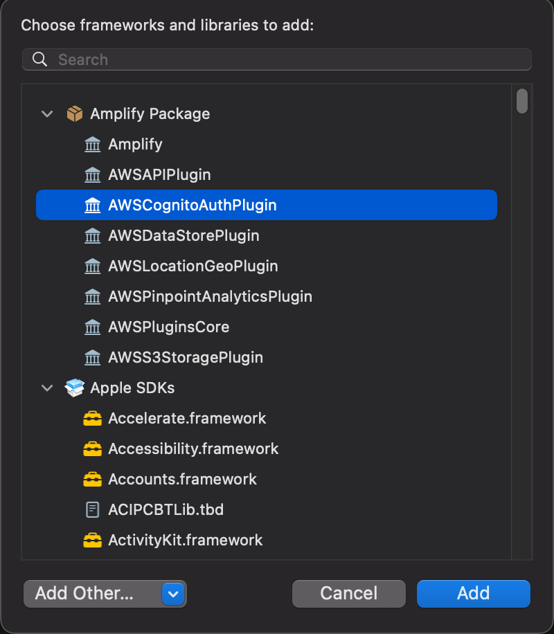

You will now see **AWSCognitoAuthPlugin** as a dependency for your project:

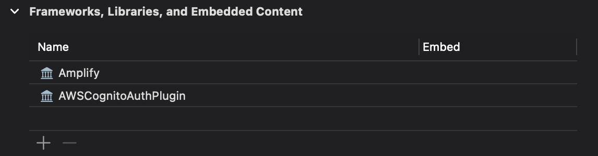

## Configure Amplify Authentication library at runtime

Back to Xcode, open `Backend.swift` file.  In the `Backend` class,

- **add** an `import` statement for the `AmplifyPlugins`
- **add a line** to the amplify initialization code we added in the previous section.

Complete code block should look like this:

```swift
// at the top of the file
import Amplify
import AWSCognitoAuthPlugin

private init () {
  // initialize amplify
  do {
     try Amplify.add(plugin: AWSCognitoAuthPlugin())
     try Amplify.configure()
     print("Initialized Amplify")
  } catch {
     print("Could not initialize Amplify: \(error)")
  }
}
```

To verify everything works as expected, build the project. Click **Product** menu and select **Build** or type **&#8984;B**. There should be no error.

## Trigger Authentication at Runtime

The remaining code change tracks the status of user (are they signed in or not?) and triggers the SignIn / SignUp user interface when user is not signed in.

1. Add signin and signout code

    Anywhere in `Backend` class, add the following three methods:

    ```swift

    // MARK: - User Authentication

    // signin with Cognito web user interface
    public func signIn() {

        Amplify.Auth.signInWithWebUI(presentationAnchor: UIApplication.shared.windows.first!) { result in
            switch result {
            case .success(_):
                print("Sign in succeeded")
            case .failure(let error):
                print("Sign in failed \(error)")
            }
        }
    }

    // signout
    public func signOut() {

        Amplify.Auth.signOut() { (result) in
            switch result {
            case .success:
                print("Successfully signed out")
            case .failure(let error):
                print("Sign out failed with error \(error)")
            }
        }
    }

    // change our internal state, this triggers an UI update on the main thread
    func updateUserData(withSignInStatus status : Bool) {
        DispatchQueue.main.async() {
            let userData : UserData = .shared
            userData.isSignedIn = status
        }
    }
    ```

2. Add an authentication hub listener

    To track the changes of authentication status, we add code to subscribe to Authentication events sent by Amplify. We initialize the Hub in the `Backend.init()` method.

    When an authentication event is received, we call the `updateUserData()` method.  This method keeps the `UserData` object in sync.  The `UserData.isSignedIn` property is `@Published`, it means the user interface is automatically refreshed when the value changes.

    We also add code to check previous authentication status at application startup time. When the application starts, it checks if a Cognito session already exists and updates the UI accordingly.

    In `Backend.init()`, **add the following code** after Amplify's initialization:

    ```Swift
    // in private init() function
    // listen to auth events.
    // see https://github.com/aws-amplify/amplify-ios/blob/master/Amplify/Categories/Auth/Models/AuthEventName.swift
    _ = Amplify.Hub.listen(to: .auth) { (payload) in

        switch payload.eventName {

        case HubPayload.EventName.Auth.signedIn:
            print("==HUB== User signed In, update UI")
            self.updateUserData(withSignInStatus: true)

        case HubPayload.EventName.Auth.signedOut:
            print("==HUB== User signed Out, update UI")
            self.updateUserData(withSignInStatus: false)

        case HubPayload.EventName.Auth.sessionExpired:
            print("==HUB== Session expired, show sign in UI")
            self.updateUserData(withSignInStatus: false)

        default:
            //print("==HUB== \(payload)")
            break
        }
    }

        // let's check if user is signedIn or not
        Amplify.Auth.fetchAuthSession { (result) in

            do {
                let session = try result.get()
                
                // let's update UserData and the UI
                self.updateUserData(withSignInStatus: session.isSignedIn)
                
            } catch {
                print("Fetch auth session failed with error - \(error)")
            }

        }    
    ```

3. Update the User Interface code

    The last change in the code is related to the User Interface, we add a `ZStack` to the `ContentView`.  Depending on `UserData.isSignedIn`'s value, the UI shows either a `SigninButton` or the main `List` view.

    Open `ContentView.swift` and **replace** `body` in `ContentView` struct:

    ```swift
    var body: some View {

        ZStack {
            if (userData.isSignedIn) {
                NavigationView {
                    List {
                        ForEach(userData.notes) { note in
                            ListRow(note: note)
                        }
                    }
                    .navigationBarTitle(Text("Notes"))
                    .navigationBarItems(leading: SignOutButton())
                }
            } else {
                SignInButton()
            }
        }
    }
    ```

    In the same file, **add** a `SignInButton` and a `SignOutButton` view:

    ```swift
    struct SignInButton: View {
        var body: some View {
            Button(action: { Backend.shared.signIn() }){
                HStack {
                    Image(systemName: "person.fill")
                        .scaleEffect(1.5)
                        .padding()
                    Text("Sign In")
                        .font(.largeTitle)
                }
                .padding()
                .foregroundColor(.white)
                .background(Color.green)
                .cornerRadius(30)
            }
        }
    }

    struct SignOutButton : View {
        var body: some View {
            Button(action: { Backend.shared.signOut() }) {
                    Text("Sign Out")
            }
        }
    }
    ```

    To verify everything works as expected, build the project. Click **Product** menu and select **Build** or type **&#8984;B**. There should be no error.

4. Update `Info.plist`

    Finally, we must ensure our app is launched at the end of the web authentication sequence, provided by Cognito hosted user interface.  We add the `gettingstarted` URI scheme to the app's `Info.plist` file.

    In Xcode, navigate to the Info.plist file (Project > Targets > Info) and add **URL types** as a key:

    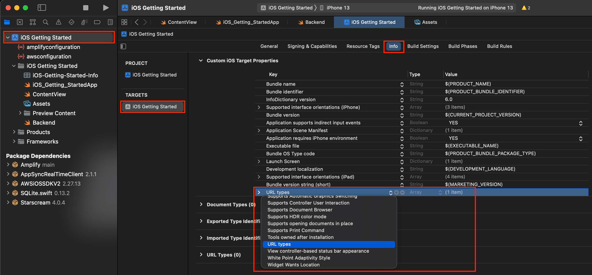

    Expand the **URL types** drop down and add **URL Schemes** to **Item 0 ()**:

    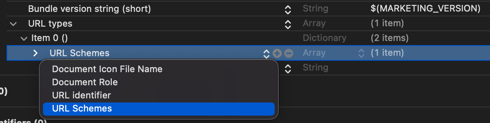

    Lastly add the value `gettingstarted` to **Item 0** under **URL Schemes**:

    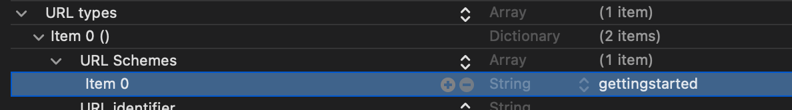


5. Build and Test

    To verify everything works as expected, build the project. Click **Product** menu and select **Run** or type **&#8984;R**. There should be no error. The app starts on the Sign In button.

Here is the full signup flow.

| Landing View | Consent to redirect| Cognito Hosted UI |
| --- | --- | --- |
| 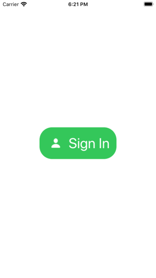 | 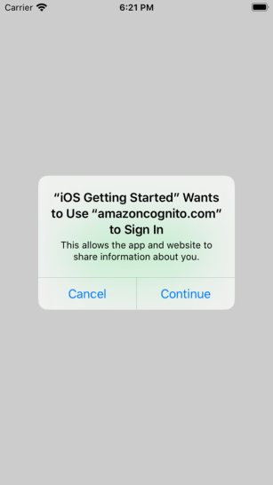 | 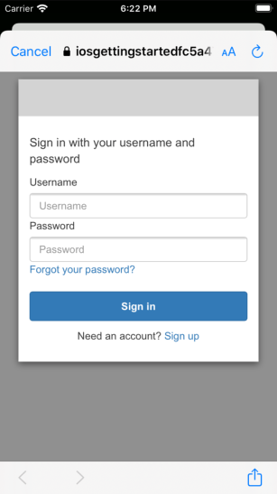

| Signup flow | Verification Code | Main View |
| --- | --- | --- |
| 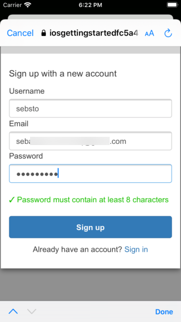 | 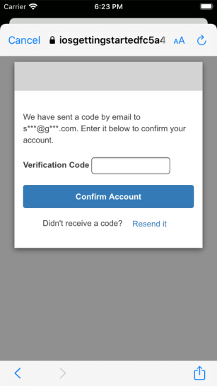 | 

[Next](/05_add_api_database.md) : Add API & Database.