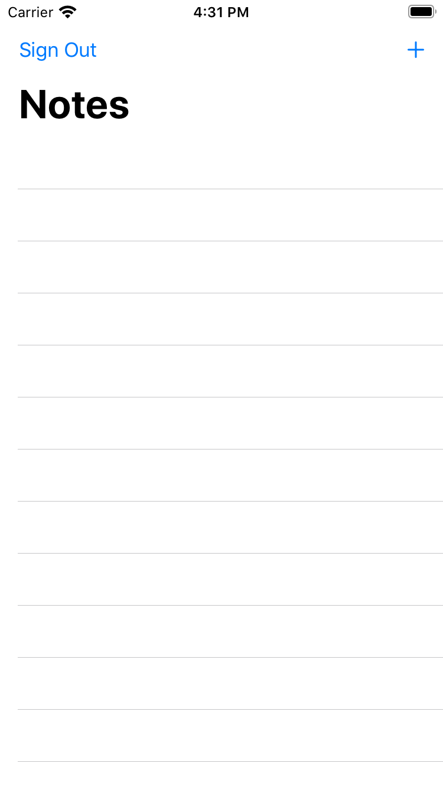
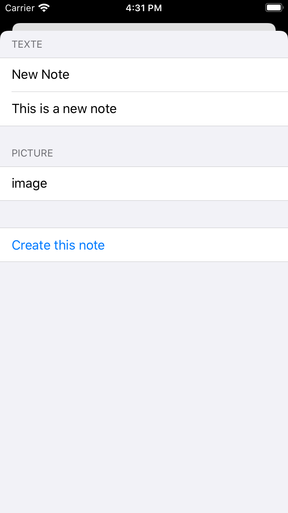
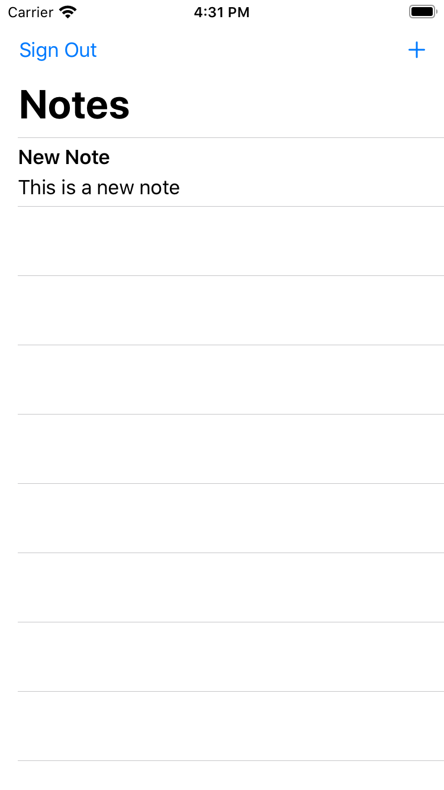
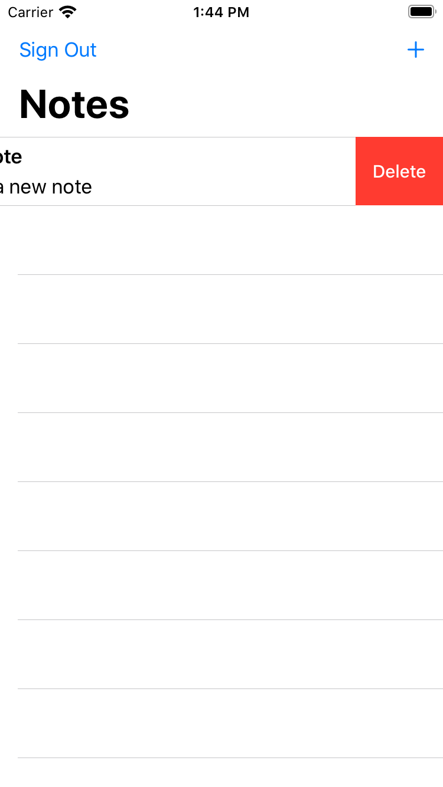

# Introduction

Now that we've created and configured the app with user authentication, let's add an API and Create, Read, Update, Delete (CRUD) operations on a database.

In this module, you will add an API to our app using the Amplify CLI and libraries. The API you will be creating is a [GraphQL](https://graphql.org) API that leverages [AWS AppSync](https://aws.amazon.com/appsync/) (a managed GraphQL service) which is backed by [Amazon DynamoDB](https://aws.amazon.com/dynamodb/) (a NoSQL database). (For an introduction to GraphQL, [visit this page](https://graphql.org/learn/).)

The app we will be building is a note taking app that allows users to create, delete, and list notes. This example gives you a good idea how to build many popular types of CRUD+L (create, read, update, delete, and list) applications.

## What You Will Learn

- Create and deploy a GraphQL API
- Write front-end code to interact with the API

## Key Concepts

**API** – Provides a programming interface that allows communication and interactions between multiple software intermediaries.

**GraphQL** – A query language and server-side API implementation based on a typed representation of your application. This API representation is declared using a schema based on the GraphQL type system. (To learn more about GraphQL, [visit this page](https://graphql.org/learn/).)

# Implementation

## Create a GraphQL API service and a Database  

To create the GraphQL API and its backing database, open a Terminal and **execute this command**:

```zsh
amplify add api
```

- *? Please select from one of the below mentioned services:* : select **GraphQL** and press **enter**
- *? Provide API name:* select the default, press **enter**
- *? Choose the default authorization type for the API*: use teh arrow key to select **Amazon Cognito User Pool** and press **enter**
- *? Do you want to configure advanced settings for the GraphQL API*: select the default **No, I am done** and press **enter**
- *? Do you have an annotated GraphQL schema?*, keep the default **N** and press **enter**
- *? Do you want a guided schema creation?* , keep the default **Y** and press **enter**
- *? What best describes your project*: choose any model, we are going to replace it with our own anyway. Press **enter**
- *? Do you want to edit the schema now?*, accept the default *Y* and press **enter**

    The default text editor that you choose when you initialized the project (`amplify init`) opens with a prebuilt data schema.  

    **Delete** the schema and **replace it** with our app GraphQL schema:

    ```graphql
    type NoteData
    @model
    @auth (rules: [ { allow: owner } ]) {
        id: ID!
        name: String!
        description: String
        image: String
    }
    ```

    The data model is made of one class `NoteData` and 4 properties : `id` and `name` are mandatory. `description` and `image` are optional Strings.

    The `@model` transfomer indicates we want to create a database to store these data.

    The `@auth` transformer adds authentication rules to allow access to these data. For this project, we want only the owner of `NoteData`s to have access to them.

    Once done, do not forget to **save**, go back to your terminal to tell Amplify CLI you're done.

- *? Press enter to continue*, press **enter**.

After a few seconds, you should see a success message:

```text
GraphQL schema compiled successfully.
```

## Generate client side code

Based on the GraphQL data model definition we just created, Amplify generates client side code (i.e. Swift code) to represent the data in our app.

To generate the code, in your terminal, **execute the following command**:

```zsh
amplify codegen models
```

This creates Swift files in `amplify/generated/models` directory, as you can see with:

```zsh
➜  iOS Getting Started git:(master) ✗ ls -al amplify/generated/models
total 24
drwxr-xr-x  5 stormacq  admin  160 Jul  9 14:20 .
drwxr-xr-x  3 stormacq  admin   96 Jul  9 14:20 ..
-rw-r--r--  1 stormacq  admin  380 Jul  9 14:20 AmplifyModels.swift
-rw-r--r--  1 stormacq  admin  822 Jul  9 14:20 NoteData+Schema.swift
-rw-r--r--  1 stormacq  admin  445 Jul  9 14:20 NoteData.swift
```

Import these files in your Xcode project: **locate** them in the Finder and **drag'n drop them** to the project in Xcode.


## Deploy the API service and database

To deploy the backend API and database we have just created, go to your terminal and **execute the command**:

```zsh
amplify push

# press Y when asked to continue
```

- *? Are you sure you want to continue?* accept the default **Y** and press **enter**
- *? Do you want to generate code for your newly created GraphQL API* **type N** and press **enter**

After a few minutes, you should see a success message:

```text
✔ All resources are updated in the cloud

GraphQL endpoint: https://yourid.appsync-api.eu-central-1.amazonaws.com/graphql
```

## Add API client library to the Xcode project

Before going to the code, you add the Amplify API Library to the dependencies of your project.  Open the `Podfile` file and **add the line** with `AmplifyPlugins/AWSAPIPlugin` or copy / paste the entire file below.

```Podfile
# you need at least version 13.0 for this turorial, more recent versions are valid too
platform :ios, '13.0'

target 'getting started' do
  # Comment the next line if you don't want to use dynamic frameworks
  use_frameworks!

  # Pods for getting started
  pod 'Amplify', '~> 1.0'                             # required amplify dependency
  pod 'Amplify/Tools', '~> 1.0'                       # allows to call amplify CLI from within Xcode

  pod 'AmplifyPlugins/AWSCognitoAuthPlugin', '~> 1.0' # support for Cognito user authentication
  pod 'AmplifyPlugins/AWSAPIPlugin', '~> 1.0'         # support for GraphQL API

end
```

In a terminal, **execute the command**:

```zsh
pod install
```

The command takes a few moments to complete. You should see this (actual version numbers may vary):

```zsh
Analyzing dependencies
Downloading dependencies
Installing AmplifyPlugins 1.0.4
Installing AppSyncRealTimeClient (1.1.6)
Installing ReachabilitySwift (5.0.0)
Installing Starscream (3.0.6)
Generating Pods project
Integrating client project
Pod installation complete! There are 4 dependencies from the Podfile and 11 total pods installed.
```

## Initialize Amplify Libs at Runtime

Back to Xcode, open `Backend.swift` and add a line in the Amplify initialisation sequence in `private init()` method. Complete code block should lool like this:

```Swift
// initialize amplify
do {
   try Amplify.add(plugin: AWSCognitoAuthPlugin())
   try Amplify.add(plugin: AWSAPIPlugin(modelRegistration: AmplifyModels()))
   try Amplify.configure()
   print("Initialized Amplify");
} catch {
   print("Could not initialize Amplify: \(error)")
}
```

## Add bridging between GraphQL data model and app model

Our project already has a data model to represent a `Note`. So I made a design decision to continue to use that model and provide for an easy way to convert a `NoteData` to a `Note`.
Open `ContentView.swift` and add this initializer in the `Note` class

```swift
convenience init(from: NoteData) {
    self.init(id: from.id, name: from.name)
    self.description = from.description
    self.imageName   = from.image

    // store API object for easy retrieval later
    self._data = from
}

fileprivate var _data : NoteData?

// access the privately stored NoteData or build one if we don't have one.
var data : NoteData {

    if (_data == nil) {
        _data = NoteData(id: self.id,
                            name: self.name,
                            description: self.description,
                            image: self.imageName)
    }

    return _data!
}
```

## Add API CRUD Methods to the `Backend` Class

Let's add 3 methods to call our API: a method to query the Note, a method to create a new Note, and a method to delete a Note. Notice that these method works on the app data model (`Note`) to make it easy to interract from the User Interface. These method transparently convert `Note` to GraphQL's `NoteData` objects.

**Open** the `Backend.swift` file and **add the following** snipet at the end of the `Backend` class:

```swift
    // MARK: API Access

    func queryNotes() {

        _ = Amplify.API.query(request: .list(NoteData.self)) { event in
            switch event {
            case .success(let result):
                switch result {
                case .success(let notesData):
                    print("Successfully retrieved list of Notes")

                    // convert an array of NoteData to an array of Note class instances
                    for n in notesData {
                        let note = Note.init(from: n)
                        DispatchQueue.main.async() {
                            UserData.shared.notes.append(note);
                        }
                    }

                case .failure(let error):
                    print("Can not retrieve result : error  \(error.errorDescription)")
                }
            case .failure(let error):
                print("Can not retrieve Notes : error \(error)")
            }
        }
    }

    func createNote(note: Note) {

        // use note.data to access the NoteData instance
        _ = Amplify.API.mutate(request: .create(note.data)) { event in
            switch event {
            case .success(let result):
                switch result {
                case .success(let data):
                    print("Successfully created note: \(data)")
                case .failure(let error):
                    print("Got failed result with \(error.errorDescription)")
                }
            case .failure(let error):
                print("Got failed event with error \(error)")
            }
        }
    }

    func deleteNote(note: Note) {

        // use note.data to access the NoteData instance
        _ = Amplify.API.mutate(request: .delete(note.data)) { event in
            switch event {
            case .success(let result):
                switch result {
                case .success(let data):
                    print("Successfully deleted note: \(data)")
                case .failure(let error):
                    print("Got failed result with \(error.errorDescription)")
                }
            case .failure(let error):
                print("Got failed event with error \(error)")
            }
        }
    }
```

Finally, we must call the API to query the list of `Note` for the currently signed in user whne the application starts. **Add** this piece of code in the `Backend`'s `private init()` method:

```swift
// inside private init() method
// let's check if user is signedIn or not
_ = Amplify.Auth.fetchAuthSession { (result) in

    do {
        let session = try result.get()

        // let's update UserData and the UI
        self.updateUserData(withSignInStatus: session.isSignedIn)

        // when user is signed in, query the database
        if session.isSignedIn {
            self.queryNotes()
        }
    } catch {
        print("Fetch auth session failed with error - \(error)")
    }

}
```

Now, all is left is to create a piece of user interface to create a new `Note` and to delete a `Note` from the list.

## Add an Edit Button to Add Note

Now that the backend and data model pieces are in place, the last step in this section is to allow users to create a new `Note` and to delete them.

In Xcode, open `ContentView.swift`

1. In `ContentView` struct, **add** state variables bound to the user interface.

    ```swift
    // add at the begining of ContentView class
    @State var showCreateNote = false

    @State var name : String        = "New Note"
    @State var description : String = "This is a new note"
    @State var image : String       = "image"
    ```

2. Anywhere in the file, **add** a `View` struct to let user create a new `Note` :

    ```swift
    struct AddNoteView: View {
        @Binding var isPresented: Bool
        var userData: UserData

        @State var name : String        = "New Note"
        @State var description : String = "This is a new note"
        @State var image : String       = "image"
        var body: some View {
            Form {

                Section(header: Text("TEXTE")) {
                    TextField("Name", text: $name)
                    TextField("Name", text: $description)
                }

                Section(header: Text("PICTURE")) {
                    TextField("Name", text: $image)
                }

                Section {
                    Button(action: {
                        self.isPresented = false
                        let noteData = NoteData(id : UUID().uuidString,
                                                name: self.$name.wrappedValue,
                                                description: self.$description.wrappedValue)
                        let note = Note(from: noteData)

                        // asynchronously store the note (and assume it will succeed)
                        Backend.shared.createNote(note: note)

                        // add the new note in our userdata, this will refresh UI
                        self.userData.notes.append(note)
                    }) {
                        Text("Create this note")
                    }
                }
            }
        }
    }
    ```

3. Add a `+` button on the navigation bar to present a sheet to create a `Note`

    Back to `ContentView` struct, **replace** `navigationBarItems(trailing:)` with

    ```Swift
        .navigationBarItems(leading: SignOutButton(),
                            trailing: Button(action: {
            self.showCreateNote.toggle()
        }) {
            Image(systemName: "plus")
        })
    }.sheet(isPresented: $showCreateNote) {
        AddNoteView(isPresented: self.$showCreateNote, userData: self.userData)
    ```

## Add a Swipe to Delete Behaviour

Finally, in `ContentView`, add the 'swipe to delete' behaviour: **add** the `.onDelete { }` method to the `ForEach` struct:

```swift
ForEach(userData.notes) { note in
    ListRow(note: note)
}.onDelete { indices in
    indices.forEach {
        // removing from user data will refresh UI
        let note = self.userData.notes.remove(at: $0)

        // asynchronously remove from database
        Backend.shared.deleteNote(note: note)
    }
}
```

## Build and Test

To verify everything works as expected, build and run the project. Click **Product** menu and select **Run** or type **&#8984;R**. There should be no error.

Assuming you are still signed in, the app starts on the emply List. It now has a `+` button to add a Note.  **Tap the + sign**, **Tap Create a Note** and the note should appear in the list.

You can close the `AddNoteView` by pulling it down.  Note that, on the iOS simulator, it is not possible to tap `+` a second time, you need to 'pull-to-refresh' the List first.

You can delete Note by swiping a row left.

Here is the complete flow.

| Empty List | Create a Note | One Note in the List | Delete a Note |
| --- | --- | --- | --- |
|  |  |  |  |

In the next section, we will add UI and behavior to manage pictures.
