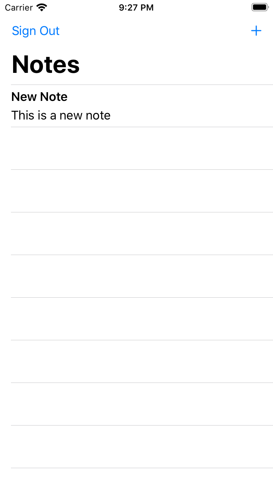
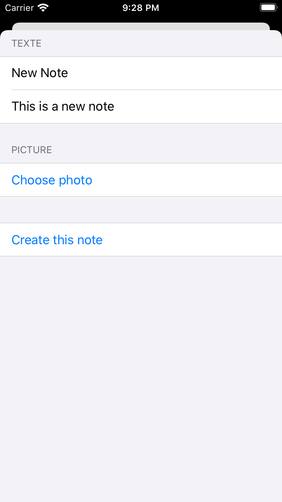
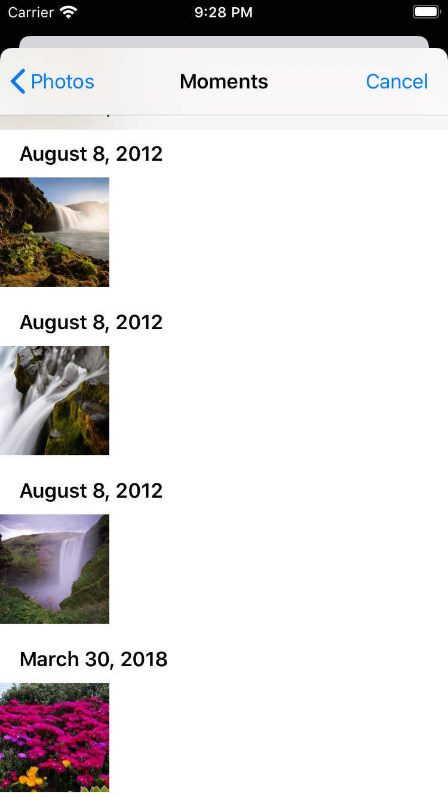
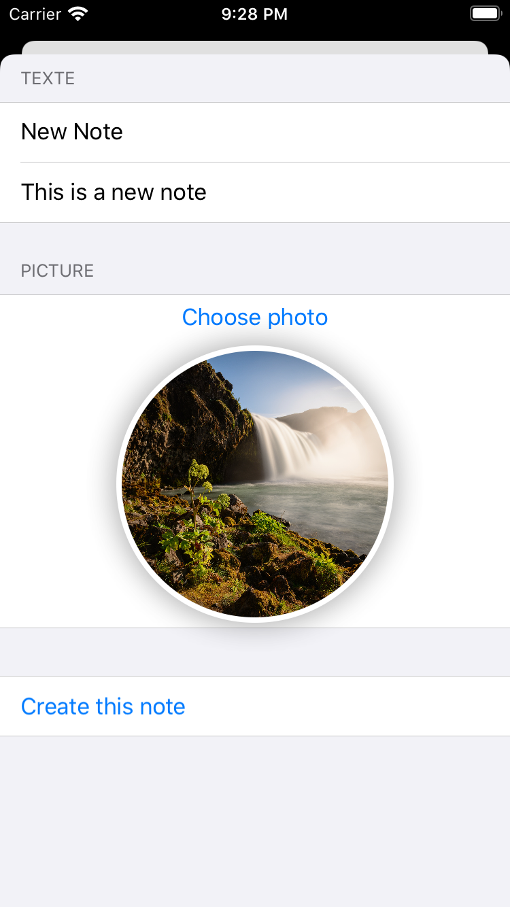
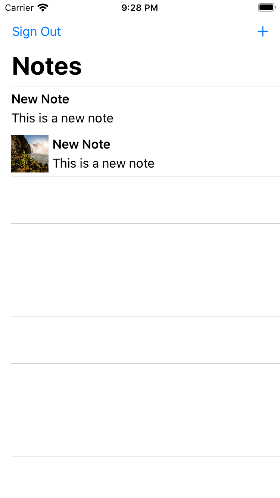

# Introduction

Now that we have the notes app working, let's add the ability to associate an image with each note. In this module, you will use the Amplify CLI and libraries to create a storage service leveraging [Amazon S3](https://aws.amazon.com/s3/). Finally, you will update the iOS app to enable image uploading, fetching, and rendering.

## What You Will Learn

- Create a storage service
- Update your IOS app - the logic to upload and download images
- Update your IOS app - the user interface

## Key Concepts

Storage service - Storing and querying for files like images and videos is a common requirement for most applications. One option to do this is to Base64 encode the file and send as a string to save in the database. This comes with disadvantages like the encoded file being larger than the original binary, the operation being computationally expensive, and the added complexity around encoding and decoding properly. Another option is to have a storage service specifically built and optimized for file storage. Storage services like Amazon S3 exist to make this as easy, performant, and inexpensive as possible.

# Implementation

## Create the Storage Service

 To add image storage functionality, we'll use the Amplify storage category:

```zsh
amplify add storage
```

- *? Please select from one of the below mentioned services:*,accept the default **Content (Images, audio, video, etc.)** and press **enter**
- *? Please provide a friendly name for your resource that will be used to label this category in the project:* type **image** and press **enter**
- *? Please provide bucket name:, accept the default and press **enter**
- *? Who should have access:*, accept the default **Auth users only** and press **enter**
- *? What kind of access do you want for Authenticated users?* select all three options **create/update, read, delete** using the space and arrows keys, then press **enter**
- *? Do you want to add a Lambda Trigger for your S3 Bucket?*, accept the default **No** and press **enter**

After a while, you should see

```text
Successfully added resource image locally
```

## Deploy the Storage Service

To deploy the storage service we have just created, go to your terminal and **execute the command**:

``` zsh
amplify push
```

Press **Y** to confirm and, after a while, you should see:

```text
✔ Successfully pulled backend environment amplify from the cloud.
```

## Add Amplify Storage Libraries to the Xcode Project

Before going to the code, you add the Amplify Storage Library to the dependencies of your project.  Open the `Podfile` file and **add the line** with `AmplifyPlugins/AWSS3StoragePlugin` or copy / paste the entire file below.

```Podfile
# you need at least version 13.0 for this tutorial, more recent versions are valid too
platform :ios, '13.0'

target 'getting started' do
  # Comment the next line if you don't want to use dynamic frameworks
  use_frameworks!

  # Pods for getting started
  pod 'Amplify', '~> 1.0'                             # required amplify dependency
  pod 'Amplify/Tools', '~> 1.0'                       # allows to call amplify CLI from within Xcode

  pod 'AmplifyPlugins/AWSCognitoAuthPlugin', '~> 1.0' # support for Cognito user authentication
  pod 'AmplifyPlugins/AWSAPIPlugin', '~> 1.0'         # support for GraphQL API
  pod 'AmplifyPlugins/AWSS3StoragePlugin', '~> 1.0'   # support for Amazon S3 storage

end
```

In a terminal, **execute the command**:

```zsh
pod install
```

The command takes a few moments to complete. You should see this (actual version numbers may vary):

```text
Analyzing dependencies
Downloading dependencies
Installing AWSS3 (2.14.2)
Installing AmplifyPlugins 1.0.4
Generating Pods project
Integrating client project
Pod installation complete! There are 5 dependencies from the Podfile and 12 total pods installed.
```

## Initialize Amplify Storage plugin at runtime

Back to Xcode, open `Backend.swift` and add a line in the Amplify initialisation sequence in `private init()` method. Complete code block should lool like this:

```swift
// initialize amplify
do {
   try Amplify.add(plugin: AWSCognitoAuthPlugin())
   try Amplify.add(plugin: AWSAPIPlugin(modelRegistration: AmplifyModels()))
   try Amplify.add(plugin: AWSS3StoragePlugin())
   try Amplify.configure()
   print("Initialized Amplify");
} catch {
   print("Could not initialize Amplify: \(error)")
}
```

## Add Image CRUD methods to the `Backend` Class

Open `Backedn.swift`. Anywhere in the `Backend` class, **add** the the following methods:

```Swift
// MARK: - Image Storage

func storeImage(name: String, image: Data) {

//        let options = StorageUploadDataRequest.Options(accessLevel: .private)
    let _ = Amplify.Storage.uploadData(key: name, data: image,// options: options,
        progressListener: { progress in
            // optionlly update a progress bar here
        }, resultListener: { event in
            switch event {
            case .success(let data):
                print("Image upload completed: \(data)")
            case .failure(let storageError):
                print("Image upload failed: \(storageError.errorDescription). \(storageError.recoverySuggestion)")
        }
    })
}

func retrieveImage(name: String, completed: @escaping (Data) -> Void) {
    let _ = Amplify.Storage.downloadData(key: name,
        progressListener: { progress in
            // in case you want to monitor progress
        }, resultListener: { (event) in
            switch event {
            case let .success(data):
                print("Image \(name) loaded")
                completed(data)
            case let .failure(storageError):
                print("Can not download image: \(storageError.errorDescription). \(storageError.recoverySuggestion)")
            }
        }
    )
}

func deleteImage(name: String) {
    let _ = Amplify.Storage.remove(key: name,
        resultListener: { (event) in
            switch event {
            case let .success(data):
                print("Image \(data) deleted")
            case let .failure(storageError):
                print("Can not delete image: \(storageError.errorDescription). \(storageError.recoverySuggestion)")
            }
        }
    )
}
```

## Load image when data are retrieved from the API

Now that we have our backend functions available, let's load the images when the API call returns.  he central place to add this behaviour is when the app construct a `Note` UI object from the `NoteData` returned by the API.

Open `ContentView.swift` and update the `Note`'s initializer:

```swift
// add a publishable's object property
@Published var image : Image?

// update init's code
convenience init(from: NoteData) {
    self.init(id: from.id, name: from.name)
    self.description = from.description
    self.imageName   = from.image

    if let name = self.imageName {
        // asynchronously download the image
        Backend.shared.retrieveImage(name: name) { (data) in
            // update the UI on the main thread
            DispatchQueue.main.async() {
                let uim = UIImage(data: data)
                self.image = Image(uiImage: uim!)
            }
        }
    }
    // store API object for easy retrieval later
    self.data = from
}
```

When an image name is present in the instance of `Note`, the code calls `retrieveImage`. This is an asynchronous function. It takes a function to call when the image is downloaded. The function creates an `Image` UI object and assign it to the instance of `Note`. Notice that this assignment triggers a User Interface update, hence it happens on the main thread of the application `DispatchQueue.main.async`.

## Add UI Code to Capture an Image

First, we add generic code to support image capture. This code can be reused in many appications, it shows an image selector allowing the user to chose an image from its image library.

In Xcode, **create a new swift file** (**&#8984;N**, then select Swift). Name the file `CaptureImageView.swift` file and **add this code**:

```swift
import Foundation
import UIKit
import SwiftUI

struct CaptureImageView {

  /// MARK: - Properties
  @Binding var isShown: Bool
  @Binding var image: UIImage?

  func makeCoordinator() -> Coordinator {
    return Coordinator(isShown: $isShown, image: $image)
  }
}

class Coordinator: NSObject, UINavigationControllerDelegate, UIImagePickerControllerDelegate {
  @Binding var isCoordinatorShown: Bool
  @Binding var imageInCoordinator: UIImage?
  init(isShown: Binding<Bool>, image: Binding<UIImage?>) {
    _isCoordinatorShown = isShown
    _imageInCoordinator = image
  }
  func imagePickerController(_ picker: UIImagePickerController,
                didFinishPickingMediaWithInfo info: [UIImagePickerController.InfoKey : Any]) {
     guard let unwrapImage = info[UIImagePickerController.InfoKey.originalImage] as? UIImage else { return }
     imageInCoordinator = unwrapImage
     isCoordinatorShown = false
  }
  func imagePickerControllerDidCancel(_ picker: UIImagePickerController) {
     isCoordinatorShown = false
  }
}

extension CaptureImageView: UIViewControllerRepresentable {
    func makeUIViewController(context: UIViewControllerRepresentableContext<CaptureImageView>) -> UIImagePickerController {
        let picker = UIImagePickerController()
        picker.delegate = context.coordinator

        // picker.sourceType = .camera // on real devices, you can capture image from the camera
        // see https://medium.com/better-programming/how-to-pick-an-image-from-camera-or-photo-library-in-swiftui-a596a0a2ece

        return picker
    }

    func updateUIViewController(_ uiViewController: UIImagePickerController,
                                context: UIViewControllerRepresentableContext<CaptureImageView>) {

    }
}
```

## Store image when Notes are created

Let's invoke the storage methods from `Backend` when a `Note` is created.
Open `ContentView.swift` and **modify** the `AddNoteView` to add an `ImagePicker` component:

```swift
// at the start of the Content View struct 
@State var image : UIImage? // replace the previous declaraion of image
@State var showCaptureImageView = false

// in the view, replace the existing PICTURE section
Section(header: Text("PICTURE")) {
    VStack {
        Button(action: {
            self.showCaptureImageView.toggle()
        }) {
            Text("Choose photo")
        }.sheet(isPresented: $showCaptureImageView) {
            CaptureImageView(isShown: self.$showCaptureImageView, image: self.$image)
        }
        if (image != nil ) {
            HStack {
                Spacer()
                Image(uiImage: image!)
                    .resizable()
                    .frame(width: 250, height: 200)
                    .clipShape(Circle())
                    .overlay(Circle().stroke(Color.white, lineWidth: 4))
                    .shadow(radius: 10)
                Spacer()
            }
        }
    }
}
```

Modify the `Create Note` section to store the image as well as the Note :

```swift
Section {
    Button(action: {
        self.isPresented = false

        let note = Note(id : UUID().uuidString,
                        name: self.$name.wrappedValue,
                        description: self.$description.wrappedValue)

        if let i = self.image  {
            note.imageName = UUID().uuidString
            note.image = Image(uiImage: i)

            // asynchronously store the image (and assume it will work)
            Backend.shared.storeImage(name: note.imageName!, image: (i.pngData())!)
        }

        // asynchronously store the note (and assume it will succeed)
        Backend.shared.createNote(note: note)

        // add the new note in our userdata, this will refresh UI
        withAnimation { self.userData.notes.append(note) }
    }) {
        Text("Create this note")
    }
}
```

## Build and Test

To verify everything works as expected, build and run the project. Click **Product** menu and select **Run** or type **&#8984;R**. There should be no error.

Assuming you are still signed in, the app starts on the list with one Note.  Use the `+` sign again to craete a Note. This time, add a picture selected from the local image store.

Here is the complete flow.

| One Note in the List | Create a Note | Pick Image 1 | Pick Image 2 | Note with Image
| --- | --- | --- | -- | -- | 
|  |  |  |  | 

## Congratulations 🥁🏆🎊🎉🎈 !

You have build an iOS application using AWS Amplify! You have added authentication to your app allowing users to sign up, sign in, and manage their account. The app also has a scalable GraphQL API configured with an Amazon DynamoDB database allowing users to create and delete notes. You have also added file storage using Amazon S3 allowing users to upload images and view them in their app.

In the last section, you will find instructions to reuse or to delete the backend we just created.

[Next](/07_cleanup.md) : Cleanup.